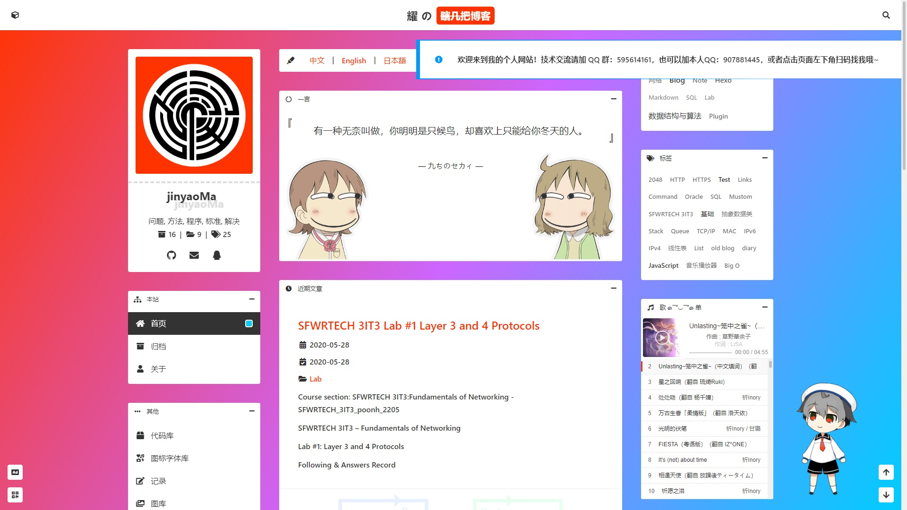
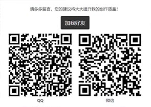
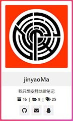
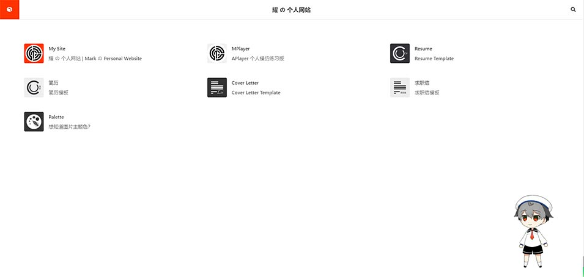

<h1 align="center">Mustom</h1>

<div align="center">

Simple design theme for VuePress，Blog，耀 の 个人网站 | Mark の Personal Website (QQ Group: 595614161)

</div>

<div align="center">

  

</div>



Language:
- [中文](./README.zh.md)
- [English](./README.md)

> **If you still feel confused after reading this documentation, please read and learn how my `$docs` is structured [here](./$docs), or welcome to ask me questions via Github Issues.**

> **Any Bug reports or suggestions can be posted into Github Issues in any format.**

# Installation

Create a folder with structure as below, and for detailed source folder structure `$docs`, see [\$docs](./$docs). `_posts` folder refers to [\$docs/_posts](./$docs/_posts).

```yml
# inside the new folder of your site

+ $docs # folder contains source of your site
  - _posts # folder contains posts
  - .vuepress # folder contains static source and config
    + public # folder contains static source
    + config.js # file stores configuration
+ package.json # file generated by using `npm init`
```

Run one of the following commands in the new folder of your site to install `vuepress` and `vuepress-theme-mustom`.

```bash
yarn add vuepress-theme-mustom -D
```

or with npm

```bash
npm i vuepress-theme-mustom -D
```

or manually download the clone `.zip` file [here](https://github.com/jinyaoMa/vuepress-theme-mustom/archive/master.zip), and extract the theme source code to the new folder of your site. Then, set `theme` attribute of `config.js` as below.

```js
theme: require.resolve('../../vuepress-theme-mustom-master/')
```

# Explanation of `_secret.tpl.js`

To see how my `_secret.tpl.js` looks like, click [here](./$docs/.vuepress/_secret.tpl.js).

Using a secret config file, any `appid` and `appkey` can be stored locally and referred to `config.js` as showed below.

```js
const secret = require('./_secret');

module.exports = { // https://www.vuepress.cn/zh/config/
  // ...
  themeConfig: {
    // ...
    translate: secret.translate, // baidu translation
    comment: secret.comment, // vssue setting
    // ...
  }
  // ...
}
```

# Explanation of `config.js`

To see how my `config.js` looks like, click [here](./$docs/.vuepress/config.js).

## General VuePress Settings

```js
module.exports = { // https://www.vuepress.cn/zh/config/
  // Entry of used theme
  // theme: require.resolve('../../'), // My value
  // theme: require.resolve('../../vuepress-theme-mustom-master/'), // manually download theme
  theme: 'vuepress-theme-mustom', // Your value
  // Site base
  // base: '/', // My value, due to https://ma-jinyao.cn/
  base: '/MyBlog/', // Your value, if https://yourUsername.github.io/MyBlog/
  // Default title that appended to your site title
  // title: '耀 の 个人网站 | Mark の Personal Website', // My value
  title: 'XXX 的博客 | XXX\'s Blog', // Your value
  // Default description that appended to your site description
  description: 'XXX 的博客, XXX\'s Blog, XXX, Mustom, VuePress',

  themeConfig: {
    // ...
    // About this section, go to header "Configuration of themeConfig"
  }

  // It isn't necessary to change 'head' if you want to replace files directly
  // favicon is in folder $docs/.vuepress/public/
  // apple-touch-icon is in folder $docs/.vuepress/public/assets/img/
  head: [
    // PWA settings, https://www.vuepress.cn/plugin/official/plugin-pwa.html
    ['link', { rel: 'icon', href: '/favicon.ico', type: "image/x-icon" }],
    ['link', { rel: 'manifest', href: '/manifest.json' }],
    ['meta', { name: 'theme-color', content: '#ffffff' }],
    ['meta', { name: 'apple-mobile-web-app-capable', content: 'yes' }],
    ['meta', { name: 'apple-mobile-web-app-status-bar-style', content: '#ffffff' }],
    ['link', { rel: 'apple-touch-icon', href: '/assets/img/apple-touch-icon.png' }]
  ],
  // It isn't necessary to change 'markdown' if you don't mind to use settings below
  // https://www.vuepress.cn/zh/config/#markdown
  markdown: {
    lineNumbers: false,
    extractHeaders: ['h1', 'h2', 'h3', 'h4', 'h5', 'h6']
  },
  // It isn't necessary to change 'evergreen'
  evergreen: true, // using old browser ?
  // To use jsdelivr cdn, you should change the publicPath below
  configureWebpack: () => {
    if (process.env.NODE_ENV === 'production') {
      return {
        output: {
          // My value, username=jinyaoMa, repo=vuepress-theme-mustom, branch=gh-pages
          //publicPath: 'https://cdn.jsdelivr.net/gh/jinyaoMa/vuepress-theme-mustom@gh-pages/'
          // Your value, if username=XXX, repo=MyBlog, branch=gh-pages
          publicPath: 'https://cdn.jsdelivr.net/gh/XXX/MyBlog@gh-pages/'
        }
      }
    }
  }
}
```

## Configuration of `themeConfig`

> All of following attributes are inside `themeConfig` of `config.js`

> `author`, `year`, `maximizeLaunch`, `noEmpty` and `images`; These attributes are very simple, and you can try yourselves. `maximizeLaunch` set to `true` can help you to fully fill the launch with image covering the window. `noEmpty` can disable the empty component that occupies the empty space. `images` can let you replace images in custom urls, but you need to follow the structure below.

```js
images: { // for image replacment; no base needed; first layer key points to component name
  ad: '/assets/img/ad.png',
  avatar: '/assets/img/avatar.png',
  brand: '/assets/img/brand.png',
  hitokoto: {
    left: '/assets/img/hitokoto.left.png',
    right: '/assets/img/hitokoto.right.png',
  },
  empty: '/assets/img/empty.png',
  records: '/assets/img/records.png',
},
```

### domain

This attribute is for sitemap generation **ONLY**.

- My value: `'https://ma-jinyao.cn'`
- Your Value: `'https://yourdomain.com/'`

### clustrmaps


Set `clustrmaps` to `null` or ignore it to disable above. This requires service from [clustrmaps.com](https://clustrmaps.com/).

```js
clustrmaps: {
  id: "clustrmaps", // clstr_globe / clustrmaps
  src: "//cdn.clustrmaps.com/map_v2.js?cl=333333&w=a&t=t&d=kuCCiVvtASTqmAMxPSTLcjxs-p8j6ht3LUi9z9Q-OKc&co=ffffff&cmo=3acc3a&cmn=ff5353&ct=333333"
},
```

### customBackgrounds

This attribute is for adding background images to the site under `skin-default`. If there are multiple images, they will be in slide show. You can have value looking like the below.

```js
customBackgrounds: [
  '/assets/img/background.png',
  'https://timgsa.baidu.com/timg?image&quality=80&size=b9999_10000&sec=1596065328389&di=ad7a9cc49e45547721005bd528325f0d&imgtype=0&src=http%3A%2F%2Fpic1.win4000.com%2Fwallpaper%2F2%2F58b4ef69ed377.jpg',
  'https://timgsa.baidu.com/timg?image&quality=80&size=b9999_10000&sec=1596063652971&di=8b659ee5cd46f4006d082b626eb3bd0d&imgtype=0&src=http%3A%2F%2Fpicture.ik123.com%2Fuploads%2Fallimg%2F180330%2F4-1P330160644.jpg'
],
```

### socialShare


Looking to [this](https://sns.goyfe.com/guide/) for reference. The following example generates the result of above.

```js
socialShare: { // https://sns.goyfe.com/guide/
  networks: ['qq', 'weibo', 'douban', 'email', 'whatsapp', 'facebook', 'reddit', 'telegram', 'line'],
  email: 'jinyao.ma@outlook.com',
  fallbackImage: '/assets/img/avatar.png',
  noGlobalSocialShare: true
},
```

### notification


> `msg` strings should be in current sequence/index. 0 => `zh`, 1 => `en`

You can have multiple notification on start up, and they will be displayed in sequence and one-by-one. `msg` contains both strings in `zh` and `en`. The following example generates the result of above.

```js
notification: [
  { // welcome msg
    type: 'default', // default or warning or error
    msg: [
      '<strong>欢迎来到我的个人网站！技术交流请加 QQ 群：595614161，也可以加本人QQ：907881445，或者点击页面左下角扫码找我哦~<strong>', // zh
      '<strong>Welcome to my personal website! <strong>' // en
    ]
  },
],
```

### qrcodes



> `locale` strings should be in current sequence/index. 0 => `zh`, 1 => `en`

`locale` contains both string in `zh` and `en`. The following example generates the result of above.

```js
qrcodes: [{ // qrcode for contact and friending
  locale: [
    'QQ', // zh
    'QQ' // en
  ],
  path: '/assets/img/qq.png' // no base needed
}, {
  locale: [
    '微信', // zh
    'WeChat' // en
  ],
  path: '/assets/img/wechat.png' // no base needed
}],
```

### header


> `sitename` strings should be in current sequence/index. 0 => `zh`, 1 => `en`

`sitename` contains both string in `zh` and `en`. The following example generates the result of above.

```js
header: {
  sitename: [
    '耀 の 个人网站', // zh
    'Mark の Personal Website' // en
  ]
},
```

### brand



> `signatures` strings should be in current sequence/index. 0 => `zh`, 1 => `en`

`signatures` contains both string in `zh` and `en`. The following example generates the result of above.

```js
brand: {
  signatures: [
    '我只想安静地做笔记', // zh
    'I just wanna note silently' // en
  ],
  contacts: [{
    icon: '<i class="fab fa-github fa-fw"></i>',
    text: 'jinyaoMa',
    link: 'https://github.com/jinyaoMa'
  }, {
    icon: '<i class="fas fa-envelope fa-fw"></i>',
    text: 'jinyao.ma@outlook.com',
    link: 'mailto://jinyao.ma@outlook.com'
  }, {
    icon: '<i class="fab fa-qq fa-fw"></i>',
    text: '907881445',
    link: 'tencent://Message/?uin=907881445'
  }]
},
```

### menus

You can erase some of the items. This attribute isn't necessary to be edited if you have the same structure as my [\$docs](./$docs). Here, the significant part is `text` under `items`. These values are keys matching the locale string in folder `locales` of the theme source, which means you need to edit the theme source code.

```js
menus: [{
  caption: 'main', // locale match
  icon: '<i class="fas fa-sitemap fa-fw"></i>',
  items: [{
    icon: '<i class="fas fa-home fa-fw"></i>',
    text: 'home', // locale match
    link: '/'
  }, {
    icon: '<i class="fas fa-archive fa-fw"></i>',
    text: 'archive', // locale match
    link: '/archive/'
  }, {
    icon: '<i class="fas fa-user fa-fw"></i>',
    text: 'about', // locale match
    link: '/about/'
  }]
}, {
  caption: 'job', // locale match
  icon: '<i class="fas fa-briefcase fa-fw"></i>',
  items: [{
    icon: '<i class="fas fa-paper-plane fa-fw"></i>',
    text: 'resume', // locale match
    link: '/resume/'
  }, {
    icon: '<i class="fas fa-file-contract fa-fw"></i>',
    text: 'letter', // locale match
    link: '/letter/'
  }]
}, {
  caption: 'others', // locale match
  icon: '<i class="fas fa-ellipsis-h fa-fw"></i>',
  items: [{
    icon: '<i class="fas fa-box fa-fw"></i>',
    text: 'codes', // locale match
    link: '/codes/'
  }, {
    icon: '<i class="fas fa-icons fa-fw"></i>',
    text: 'icons', // locale match
    link: '/icons/'
  }, {
    icon: '<i class="fas fa-edit fa-fw"></i>',
    text: 'records', // locale match
    link: '/records/'
  }, {
    icon: '<i class="fas fa-images fa-fw"></i>',
    text: 'gallery', // locale match
    link: '/gallery/'
  }]
}],
```

### meting


The following example generates the result of above.

```js
meting: {
  server: 'netease', // netease, tencent, kugou, xiami, baidu
  type: 'playlist', // song, playlist, album, search, artist
  id: '4989572738', // song id / playlist id / album id / search keyword
  theme: 'var(--link)', // e.g. #ff3300
  height: '297px' // playlist height, 297px ==> 9 lines
},
```

### portals



The following example generates the result of above.

```js
// external links; use for the component that displays after clicking on the left-top button of header
portals: [{
  name: 'My Site',
  desc: '耀 の 个人网站 | Mark の Personal Website',
  icon: 'https://jinyaoMa.github.io/asset/img/author.medium.png',
  link: 'https://jinyaoMa.github.io/'
}, {
  name: 'MPlayer',
  desc: 'APlayer 个人模仿练习版',
  icon: 'https://blog.ma-jinyao.cn/asset/img/icon.medium.png',
  link: 'https://blog.ma-jinyao.cn/MPlayer'
}, {
  name: 'Resume',
  desc: 'Resume Template',
  icon: 'https://blog.ma-jinyao.cn/extension/resume/icon.png',
  link: 'https://blog.ma-jinyao.cn/extension/resume/english/'
}, {
  name: '简历',
  desc: '简历模板',
  icon: 'https://blog.ma-jinyao.cn/extension/resume/icon.reverse.png',
  link: 'https://blog.ma-jinyao.cn/extension/resume/chinese/'
}, {
  name: 'Cover Letter',
  desc: 'Cover Letter Template',
  icon: 'https://blog.ma-jinyao.cn/extension/letter/icon.png',
  link: 'https://blog.ma-jinyao.cn/extension/letter/english/'
}, {
  name: '求职信',
  desc: '求职信模板',
  icon: 'https://blog.ma-jinyao.cn/extension/letter/icon.reverse.png',
  link: 'https://blog.ma-jinyao.cn/extension/letter/chinese/'
}, {
  name: 'Palette',
  desc: '想知道图片主题色？',
  icon: 'https://blog.ma-jinyao.cn/extension/palette/icon.png',
  link: 'https://blog.ma-jinyao.cn/extension/palette/'
}],
```

### hitokoto

You can put your words to `customs` for displaying, and these words are randomly picked on home page loaded. `type` is for hitokoto service setting referred to [developer.hitokoto.cn](https://developer.hitokoto.cn/sentence/#请求参数)

```js
hitokoto: {
  customs: [/*{ // format; if customs exist, API will be ignored, and customs will be in use
    word: 'https://developer.hitokoto.cn',
    from: '一言开发者中心'
  }*/],
  type: 'i' // https://developer.hitokoto.cn/sentence/#请求参数
},
```

### gallery

You can add online images to gallery page, and they will be inserted to very top of the page and following by your local images that are auto appended. Local images are located at `/$docs/.vuepress/public/gallery`. To see mine, click [here](./$docs/.vuepress/public/gallery).

```js
gallery: [/*{ format; these gallery items will be appended to /gallery/ page
  name: 'test image from baidu',
  url: 'https://timgsa.baidu.com/timg?image&quality=80&size=b9999_10000&sec=1596063652971&di=8b659ee5cd46f4006d082b626eb3bd0d&imgtype=0&src=http%3A%2F%2Fpicture.ik123.com%2Fuploads%2Fallimg%2F180330%2F4-1P330160644.jpg'
}*/],
```

### pwa

> `message` and `buttonText` strings should be in current sequence/index. 0 => `zh`, 1 => `en`

`message` and `buttonText` contain both string in `zh` and `en`.

`popupComponent` is set to the custom component in theme source code. If you don't like the update popup, you can set `updatePopup` to `false`. Or if you don't want to use service worker, you can set both `serviceWorker` and `updatePopup` to `false`.

```js
pwa: { // https://www.vuepress.cn/plugin/official/plugin-pwa.html
  serviceWorker: true,
  popupComponent: 'CustomSWUpdatePopup',
  updatePopup: {
    message: [
      '检测到可用的新内容。', // zh
      'New content is available.' // en
    ],
    buttonText: [
      '更新缓存', // zh
      'Refresh' // en
    ]
  }
}
```